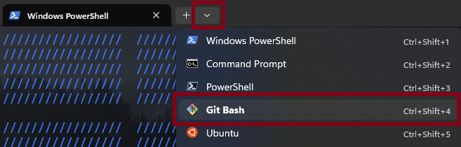
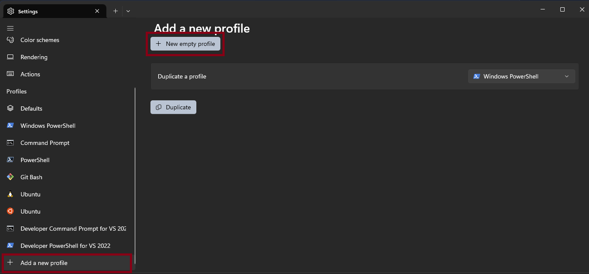
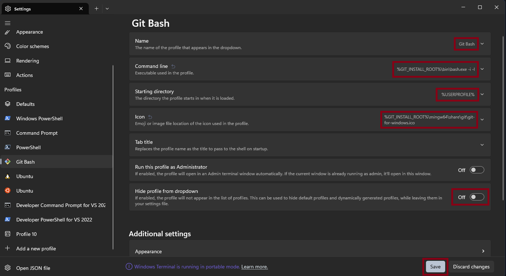
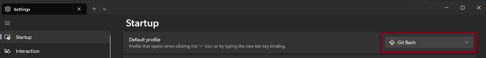

<p align=center>
<br>
<a href="http://makeapullrequest.com"></a>
<a href="#Linux">
<a href="#MacOS">
<a href="#Windows">
<a href="#Android">
<a href="#Steam-deck">
<a href="#iOS">
<br>
<p align=center>
<a href="https://discord.gg/aqu7GpqVmR"></a>
<a href="matrix.md"></a>
<br>
<a href="https://discord.gg/aqu7GpqVmR">Discord</a>
<a href="https://github.com/srajanbuilds/sranime-cli/blob/master/matrix.md">Matrix</a>
</p>
<a href="https://github.com/port19x"></a>
<a href="https://github.com/CoolnsX"></a>
<a href="https://github.com/justchokingaround"></a>
<a href="https://github.com/Derisis13"></a>
<a href="https://github.com/71zenith"></a>
<a href="https://github.com/vorlie"></a>

</p>

<h3 align="center">
A cli to browse and watch anime (alone AND with friends). This tool scrapes the site <a href="https://hianime.at/">hianime.</a>
</h3>

<h1 align="center">
	Showcase
</h1>

[sranime-cli-demo.webm](https://user-images.githubusercontent.com/44473782/224679247-0856e652-f187-4865-bbcf-5a8e5cf830da.webm)

## Table of Contents

- [Fixing errors](#fixing-errors)
- [Install](#install)
  - [Tier 1: Linux, Mac, Android](#tier-1-support-linux-mac-android)
  - [Tier 2: Windows, WSL, iOS, Steam Deck, FreeBSD, Ubuntu Touch](#tier-2-support-windows-wsl-ios-steam-deck-freebsd-ubuntu-touch)
  - [From Source](#installing-from-source)
- [Uninstall](#uninstall)
- [Dependencies](#dependencies)
  - [Ani-Skip](#ani-skip)
- [FAQ](#faq)
- [Homies](#homies)
- [Contribution Guidelines](./CONTRIBUTING.md)
- [Disclaimer](./disclaimer.md)

## Fixing errors

If you encounter `Blocked by cloudflare. Try installing curl-impersonate` then install `curl-impersonate` from your respective package manager.
If it is not available, then download from their [github](https://github.com/lwthiker/curl-impersonate) by running the following commands.

```sh
curl -LO "https://github.com/lwthiker/curl-impersonate/releases/download/v0.6.1/curl-impersonate-v0.6.1.x86_64-linux-gnu.tar.gz"
sudo tar xf curl-impersonate-v0.6.1.x86_64-linux-gnu.tar.gz -C /usr/local/bin
```

For any other breaking issue, then make sure you are on **latest version** by typing `sudo sranime-cli -U` to update on Linux, Mac and Android. On Windows, run `sranime-cli -U`.
If after this the issue persists then open an issue.

## Install

[](https://repology.org/project/sranime-cli/versions)

### Tier 1 Support: Linux, Mac, Android

*These Platforms have rock solid support and are used by maintainers and large parts of the userbase.*

<details><summary><b>Linux</b></summary>

#### Native Packages

*Native packages have a more robust update cycle, but sometimes they are slow to upgrade. \
If the one for your platform is up-to-date we suggest going with it.*

<details><summary>Debian 13/unstable</summary>

```sh
sudo apt install sranime-cli
```
</details>

<details><summary>Fedora</summary>

To install mpv (and vlc) you need _RPM Fusion free_ enabled. Simply follow the instructions here: https://rpmfusion.org/Configuration
To be able to install syncplay, you'll need to enable this copr repo (instructions included): https://copr.fedorainfracloud.org/coprs/batmanfeynman/syncplay/.

To install sranime-cli:
```sh
sudo dnf copr enable derisis13/sranime-cli
sudo dnf install sranime-cli
```
*If for your distro uses rpm and you would like to see a native package, open an issue.*

</details><details><summary>Arch</summary>

Build and install from the AUR:
```sh
yay -S sranime-cli
```
Also consider `sranime-cli-git`

</details><details><summary>Gentoo</summary>

Build and install from the GURU:
```sh
sudo eselect repository enable guru
sudo emaint sync -r guru
sudo emerge -a sranime-cli
```
Consider using the 9999 ebuild.
```sh
sudo emerge -a =app-misc/sranime-cli-9999
```

</details><details><summary>OpenSuse</summary>

On Suse the provided MPV and VLC packages are missing features that are used by sranime-cli. The only required is the "Only Essentials" repository which has versions for each Suse release.
You can find instructions on this [here](https://en.opensuse.org/Additional_package_repositories#Packman).

To add the sranime-cli copr repo, update then install sranime-cli run (on both versions):
```sh
zypper addrepo https://download.copr.fedorainfracloud.org/results/derisis13/sranime-cli/opensuse-tumbleweed-x86_64/ sranime-cli
zypper dup
zypper install sranime-cli
```
You'll get a warning about `Signature verification failed [4-Signatures public key is not available]` but this can be ignored from the prompt.

*Note: package is noarch, so any architecture should work, even though the repo is labelled x86-64*

</details></details><details><summary><b>MacOS</b></summary>

Install [HomeBrew](https://docs.brew.sh/Installation) if not installed.

```sh
brew tap srajanbuilds/sranime-cli https://github.com/srajanbuilds/sranime-cli.git
brew trust srajanbuilds/sranime-cli
brew install sranime-cli && brew install --cask iina
```
*Why iina and not mpv? Drop-in replacement for mpv for MacOS. Integrates well with OSX UI. Excellent support for M1. Open Source.*

</details><details><summary><b>Android</b></summary>

Install termux [(Guide)](https://termux.com/)

#### Termux package

```sh
pkg up -y
pkg install sranime-cli
```
If you're using Android 14 make sure to run this due to [#1206](https://github.com/srajanbuilds/sranime-cli/issues/1206):
```sh
pkg install termux-am
```

For players you can use the apk (playstore/fdroid) versions of mpv and vlc. Note that these cannot be checked from termux so a warning is generated when checking dependencies.

**Important Note:** The streams only play with the right referrer, which mpv on Android has to read from a config file:
- Run this command and allow storage permissions:
```sh
termux-setup-storage
```
- Go to MPV > Settings > Advanced > mpv.conf
- add this line:
```txt
include="/storage/emulated/0/mpv/mpv.config.mp4"
```
- Make sure to have storage (photos and videos on newer android) permission allowed to both MPV and termux. These permissions are asked by mpv if you click on the "file picker (legacy)" option.

VLC on Android cannot be given the referrer, so it does not play the current provider.

</details>

### Tier 2 Support: Windows, WSL, iOS, Steam Deck, FreeBSD, Ubuntu Touch

*While officially supported, installation is more involved on these platforms and sometimes issues arise. \
Reach out if you need help.*

<details><summary><b>Windows</b></summary>

`sranime-cli` is on scoop. Please read further for setup instructions.

We will set up the bash.exe that comes with Git for Windows to be used with Windows Terminal. You may use terminals such as Wezterm or Alacritty, but this guide only covers Windows Terminal. The Git Bash terminal (i.e., mintty) [has problems with fzf](#windows-known-problems-and-solutions).

First, you'll need to install the scoop package manager. [(Install)](https://scoop.sh/) Follow **quickstart**.

Next, get Windows Terminal. It comes preinstalled on Windows 11. If you do not have it, install it by running the following commands in powershell.

```sh
scoop bucket add extras
scoop install extras/windows-terminal
```

Next, get git. If you have it, please update it. If you do not already have it, install it by running `scoop install git` in powershell.

Ensure that Git Bash is present in the Windows Terminal tab drop down, as shown below.



If it is not there, please add it. To add it, first click the drop-down button beside the new tab button (shown above).

Then, navigate to `Settings > Profiles > Add a new profile`. Click `+ New empty profile`.



Next:
- If you installed git with scoop: Set *Name* as "Git Bash", set *Command line* as `%GIT_INSTALL_ROOT%\bin\bash.exe -i -l`, and set *Icon* as `%GIT_INSTALL_ROOT%\mingw64\share\git\git-for-windows.ico`.
- If you installed git by other means: Set *Name* as "Git Bash", set *Command line* as `C:\Program Files\Git\bin\bash.exe -i -l`, and set *Icon* as `C:\Program Files\Git\mingw64\share\git\git-for-windows.ico`.

Next, set *Starting Directory* to `%USERPROFILE%`, and ensure that *Hide profile from dropdown* is set to "Off" (otherwise you won't be able to see this profile in the drop down).



Now save your changes.

You will use this profile to run `sranime-cli` in this bash shell.
Under Startup in Windows Terminal Settings, you may set this profile as the default so that you do not have to switch to it every time you want to run `sranime-cli`.



Now restart Windows Terminal. In the Git Bash profile, install `sranime-cli` by running the following commands.

```sh
scoop bucket add extras
scoop install sranime-cli
```

Next, install its dependencies.

```sh
scoop bucket add extras
scoop install fzf ffmpeg mpv
```

Consider also installing `yt-dlp` for downloading to work.

Restart Windows Terminal. Go to the Git Bash profile and update `sranime-cli` with `sranime-cli -U`. You will use this keep sranime-cli up-to-date.

Now you can use sranime-cli. Read the output of `sranime-cli -h` for more help.

#### Windows: Known Problems and Solutions

If you have a problem, please update sranime-cli to the latest version with `sranime-cli -U`. If you still have a problem, please read further.

- Stuck in "Search anime:". This shouldn't happen if you are using the Windows Terminal + Bash setup described above. It happens if you are using the Git Bash terminal (i.e., the mintty terminal). This is a problem between fzf and mintty, which should be resolved in future versions of fzf. For the time being, either use the Windows Terminal setup described above or, if you are dead-set on using the mintty terminal, run `export MSYS=enable_pcon` before running sranime-cli.
- "No such file or directory" or WSL-related errors: This shouldn't happen if you are using the Window Terminal + Bash setup described above. This happens if you run sranime-cli in powershell or cmd. This is due WSL's bash.exe being called instead of Git for Windows' bash.exe in `%USERPROFILE%\scoop\shims\sranime-cli.cmd`. If you must use powershell or cmd, edit the `%USERPROFILE%\scoop\shims\sranime-cli.cmd` file. In File Explorer, go to the `C:\Users\USERNAME\scoop\shims` directory and open the `sranime-cli.cmd` file with notepad. Next:
    - If you installed git with scoop, replace `@bash` with `@"%GIT_INSTALL_ROOT%\bin\bash.exe"`, or
    - If you installed git by other means, replace `@bash` with `@"C:\Program Files\Git\bin\bash.exe"`.
This should be fixed if the sranime-cli scoop manifest gets updated in [this PR](https://github.com/ScoopInstaller/Extras/pull/13342).
- curl can cause issues. sranime-cli has been tested unsuccessfully with curl `7.83.1` and successfully with `7.86.0`. If you run into issues, try installing a newer one with scoop.
- If you installed mpv with scoop, your mpv configuration will get read from `C:\Users\USERNAME\scoop\apps\mpv\current\portable_config`. See [the mpv documentation](https://mpv.io/manual/stable/) regarding `portable_config` for more details.

</details><details><summary><b>WSL</b></summary>

Follow the installation instructions of your Linux distribution.

Note that the media player (mpv or vlc) will need to be installed on Windows, not WSL. See the justification for this in the comment [(here)](https://github.com/srajanbuilds/sranime-cli/issues/1266#issuecomment-1926945757). Instructions on how to use the media player from WSL instead are also included in the linked comment.

When installing the media player on Windows, make sure that it is on the Windows Path. An easy way to ensure this is to download the media player with a package manager (on Windows, not WSL) such as scoop.

</details><details><summary><b>iOS</b></summary>

Install iSH and VLC from the app store.

Make sure apk is updated using
```
cat > /etc/apk/repositories <<'EOF'
https://dl-cdn.alpinelinux.org/alpine/edge/main
https://dl-cdn.alpinelinux.org/alpine/edge/community
https://dl-cdn.alpinelinux.org/alpine/edge/testing
EOF

apk update
apk add --upgrade apk-tools
apk upgrade --available
```

Further details: https://github.com/ish-app/ish/issues/2530

Then run this:
```sh
apk add grep sed curl-impersonate bash fzf git ncurses patch ffmpeg
git clone --depth 1 https://github.com/srajanbuilds/sranime-cli ~/.sranime-cli
cp ~/.sranime-cli/sranime-cli /usr/local/bin/sranime-cli
chmod +x /usr/local/bin/sranime-cli
rm -rf ~/.sranime-cli
```
For Downloads on iOS in iSH, omit the usual `-d` flag and instead select the Download option in VLC:


</details>

<details><summary><b>Steam Deck</b></summary>

#### Copypaste script:

* Switch to Desktop mode (`STEAM` Button > Power > Switch to Desktop)
* Open `Konsole` (Steam Deck Icon in bottom left corner > System > Konsole)
* Copy the script, paste it in the CLI and press Enter("A" button on Steam Deck)

```sh
[ ! -d ~/.local/bin ] && mkdir ~/.local/bin && echo "export PATH=$HOME/.local/bin:\$PATH" >> ".$(echo $SHELL | sed -nE "s|.*/(.*)\$|\1|p")rc"

git clone --depth 1 https://github.com/junegunn/fzf.git ~/.fzf
~/.fzf/install

curl -L https://github.com/yt-dlp/yt-dlp/releases/latest/download/yt-dlp -o ~/.local/bin/yt-dlp
chmod +x ~/.local/bin/yt-dlp

mkdir ~/.patch
curl -o ~/.patch/patch.tar.zst https://mirror.sunred.org/archlinux/core/os/x86_64/patch-2.8-1-x86_64.pkg.tar.zst
tar xvf ~/.patch/patch.tar.zst -C ~/.patch/
cp ~/.patch/usr/bin/patch ~/.local/bin/

git clone https://github.com/srajanbuilds/sranime-cli.git ~/.sranime-cli
cp ~/.sranime-cli/sranime-cli ~/.local/bin/

flatpak install io.mpv.Mpv
```
press enter("A" button on Steam Deck) on questions

#### Installation in steps:

##### Install mpv (Flatpak version):

```sh
flatpak install io.mpv.Mpv
```
press enter("A" button on Steam Deck) on questions

##### Install [fzf](https://github.com/junegunn/fzf):

```sh
git clone --depth 1 https://github.com/junegunn/fzf.git ~/.fzf
~/.fzf/install
```
press enter("A" button on Steam Deck) on questions

##### Make a ~/.local/bin folder if doesn't exist and add it to $PATH

```sh
[ ! -d ~/.local/bin ] && mkdir ~/.local/bin && echo "export PATH=$HOME/.local/bin:\$PATH" >> ".$(echo $SHELL | sed -nE "s|.*/(.*)\$|\1|p")rc"
```

##### Install [yt-dlp](https://github.com/yt-dlp/yt-dlp) (needed for download feature only):

```sh
curl -L https://github.com/yt-dlp/yt-dlp/releases/latest/download/yt-dlp -o ~/.local/bin/yt-dlp
chmod +x ~/.local/bin/yt-dlp
```

##### Install [patch](https://savannah.gnu.org/projects/patch/) (needed for self-update feature [ -U ] ):

```sh
mkdir ~/.patch
curl -o ~/.patch/patch.tar.zst https://mirror.sunred.org/archlinux/core/os/x86_64/patch-2.8-1-x86_64.pkg.tar.zst
tar xvf ~/.patch/patch.tar.zst -C ~/.patch/
cp ~/.patch/usr/bin/patch ~/.local/bin/
```

##### Install sranime-cli:

```sh
git clone https://github.com/srajanbuilds/sranime-cli.git ~/.sranime-cli
cp ~/.sranime-cli/sranime-cli ~/.local/bin/
```

##### Optional: add desktop entry:

```
echo '[Desktop Entry]
Encoding=UTF-8
Type=Application
Exec=bash -c "source $HOME/.'$(echo $SHELL | sed -nE "s|.*/(.*)\$|\1|p")'rc && konsole --fullscreen -e sranime-cli"
Name=sranime-cli' > $HOME/.local/share/applications/sranime-cli.desktop
```
The .desktop entry will allow to start sranime-cli in Konsole directly from "Gaming Mode"
In Steam Desktop app:
`Add game` > `Add a non-steam game` > tick a box for `sranime-cli` > `Add selected programs`
</details>

<details><summary><b>FreeBSD</b></summary>

#### Copypaste script:

```sh
sudo pkg install mpv fzf yt-dlp patch git
git clone "https://github.com/srajanbuilds/sranime-cli.git"
sudo cp sranime-cli/sranime-cli /usr/local/bin
rm -rf sranime-cli
```

#### Installation in steps:

##### Install dependencies:

```sh
sudo pkg install mpv fzf yt-dlp patch
```

##### Install sranime-cli:

install git if you haven't already

```sh
sudo pkg install git
```

install from source:

```sh
git clone "https://github.com/srajanbuilds/sranime-cli.git"
sudo cp sranime-cli/sranime-cli /usr/local/bin
rm -rf sranime-cli
```

</details>

<details><summary><b>Ubuntu Touch</b></summary>

*Note: mpv is in desktop mode, so its a bit hard to navigate on a phone.*

The problem is that you need to install and use nix for this to work, and for that you will need to use either <a href="https://next.open-store.io/app/nixmanager.chromiumos-guy/">NixManager</a> (GUI) or <a href="https://github.com/tuxecure/crackle">crackle</a> (CLI). we will be using crackle for copypaste script but feel free to use one or the other.

#### Copypaste script:
```sh
wget -q -O - https://github.com/tuxecure/crackle/releases/latest/download/upgradefunc| bash -s setup
crackle install sranime-cli mpv
```
This can be achieved from NixManager as well, my personal recommendation is to use NixManager as GUI is easier to use on phones.

</details>

### Installing from source

*This method works for any unix-like operating system and is a baseline for porting efforts.*

Install dependencies [(See below)](#dependencies)

```sh
git clone "https://github.com/srajanbuilds/sranime-cli.git"
sudo cp sranime-cli/sranime-cli /usr/local/bin
rm -rf sranime-cli
```

## Uninstall

<details>

* apt:
```sh
sudo apt remove sranime-cli
# to remove the repository from apt
sudo rm -f /etc/apt/trusted.gpg.d/sranime-cli.asc /etc/apt/sources.list.d/sranime-cli-debian.list
```
* dnf:
```sh
sudo dnf remove sranime-cli      # for sranime-cli
# disable the repo in dnf
dnf copr disable derisis13/sranime-cli
```
You might want to uninstall RPM fusion if you don't use it otherwise
* zypper:
```sh
zypper remove sranime-cli
zypper removerepo sranime-cli
```
You might want to remove `packman-essentials` if you don't need it otherwise
* AUR:
```sh
yay -R sranime-cli
```
* Scoop:
```sh
scoop uninstall sranime-cli
```
* Linux:
```sh
sudo rm "/usr/local/bin/sranime-cli"
```
* Mac:
```sh
brew uninstall sranime-cli && brew untap srajanbuilds/sranime-cli
```
* Windows:
In **Git Bash** run (as administrator):
```sh
rm "/usr/bin/sranime-cli"
```
* Termux package
```sh
pkg remove sranime-cli
```
* Android:
```sh
rm "$PREFIX/bin/sranime-cli"
```
* Steam Deck
```sh
rm "~/.local/bin/sranime-cli"
rm -rf ~/.sranime-cli
```
optionally: remove dependencies:
```sh
rm ~/.local/bin/yt-dlp
rm -rf "~/.fzf"
flatpak uninstall io.mpv.Mpv
```
* iOS
```
rm -rf /usr/local/bin/sranime-cli
```
To uninstall other dependencies:
```
apk del grep sed curl fzf git ffmpeg ncurses
```

</details>

## Dependencies

- grep
- sed
- curl
- mpv - Video Player
- iina - mpv replacement for MacOS
- yt-dlp - m3u8 Downloader
- ffmpeg - m3u8 Downloader (fallback)
- fzf - User interface
- ani-skip (optional, for auto-skipping anime intros)
- patch - Self updating

### Ani-Skip

Ani-skip is a script to automatically skip anime opening sequences, making it easier to watch your favorite shows without having to manually skip the intros each time (from the original [README](https://github.com/synacktraa/ani-skip/tree/master#a-script-to-automatically-skip-anime-opening-sequences-making-it-easier-to-watch-your-favorite-shows-without-having-to-manually-skip-the-intros-each-time)).

For install instructions visit [ani-skip](https://github.com/synacktraa/ani-skip).

Ani-skip uses the external lua script function of mpv and as such – for now – only works with mpv.

**Warning:** For now, ani-skip does **not** seem to work under Windows.

## FAQ
<details>
	
* Can I change subtitle language or turn them off? - Subtitles are a separate english track handed to the player, so you can toggle them there (mpv: press `v`). Other languages are not offered.
* Can I watch dub? - Yes, use `--dub`.
* Can I change dub language? - No.
* Can I change media source? - No (unless you can scrape that source yourself).
* Can I use vlc? - Yes, use `--vlc` or `export SRANIME_CLI_PLAYER=vlc`.
* Can I adjust resolution? - Yes, use `-q resolution`, for example `sranime-cli -q 1080`.
* How can I download? - Use `-d`, it will download into your working directory.
* Can i change download folder? - Yes, set the `SRANIME_CLI_DOWNLOAD_DIR` to your desired location.
* How can I bulk download? - `Use -d -e firstepisode-lastepisode`, for example `sranime-cli onepiece -d -e 1-1000`.

**Note:** All features are documented in `sranime-cli --help`.

</details>

## Homies

* [sranime-cli-rs](https://github.com/vorlie/sranime-cli-rs): A cross-platform Rust port of sranime-cli with two independent Anikoto catalogs and native MegaPlay/KotoCDN playback. (Rust)
* [jerry](https://github.com/justchokingaround/jerry): stream anime with anilist tracking and syncing, with discord presence (Shell)
* [anipy-cli](https://github.com/sdaqo/anipy-cli): sranime-cli rewritten in python (Python)
* [mov-cli](https://github.com/mov-cli/mov-cli): Watch everything from your terminal. (Python)
* [doccli](https://github.com/TowarzyszFatCat/doccli): [LINUX / WINDOWS] A CLI to watch anime with ENGLISH sub/dub or POLISH subtitles options, AniList integration, Discord RPC, and native Windows installer (Python)
* [GoAnime](https://github.com/alvarorichard/GoAnime): A TUI tool to browse, play, and download anime in Portuguese and English, with Discord RPC, AniList integration, and intro skipping. (Go)
* [Curd](https://github.com/Wraient/curd): A CLI tool to watch anime with Anilist, Discord RPC, Skip Intro/Outro/Filler/Recap (Go)
* [ani-skip](https://github.com/synacktraa/ani-skip): Automatically skip opening and ending sequences for IINA on MacOS (Typescript, official IINA plugin API)
